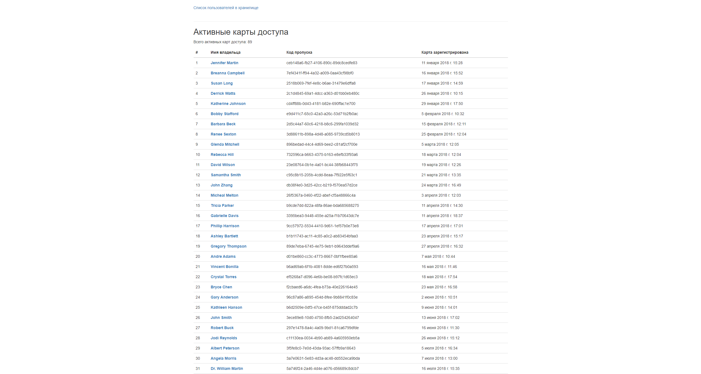

# Пульт охраны


Это сайт, на котором отоброжается информация о посетителе по пропуску, дату входа и выхода, проверяет на подозрительность визита(ограничение по длительности визита можно указать).


## Запуск сайта


Для запуска сайта потребуется *python* версии не ниже 3.8 и библиотека *django* версии 2.9. Чтобы скрипт мог взаимодействовать с базой данных, необходимо ввести требуемые данные в файл *project/settings.py*. 
Все зависимости можно установить командой:
```
pip install -r requirements.txt
```

Для запуска сайта потребуется ввести команду в терминал
```
python manage.py runserver 0.0.0.0:8000
```


## Пример использования


После запуска в консоли вы увидите  
Это означает что скрипт начал работать. Далее нужно перейти по [ссылке](http://0.0.0.0:8000) или по второй [ссылке](http://127.0.0.1:8000) если не открывается по первой.
Перейдя по ссылке откроется таблица с активными пропусками, паролями и датой их регистрации  Так же можно перейти к списку всех посещений владельца пропуска, для этого нужно кликнуть по имени владельца пропуска. В списке содержатся дата посещения, его продолжительность и проверка на подозрительность. В данном случае посещение является подозрительным, если владелец пропуска был в помещении более 1 часа  Еще есть возможность просмотра кто находится в помещении в данный момент, и там так же есть проверка на подозрительность 


## Реализация


### Получение активных пропусков из базы данных.
Код из 
```python
from datacenter.models import Passcard
from django.shortcuts import render


def active_passcards_view(request):
    active_passcard = Passcard.objects.filter(is_active=True)
    context = {
        'active_passcards': active_passcard,
    }
    return render(request, 'active_passcards.html', context)

```

#### Краткая информация работы алгоритма

В *active_passcard* получает отфильтрованный список пропусков из базы данных со статусом *is_active*. Далее рендерится html страница из шаблона подставляя информацию из сформированного словаря *context*.


### Получение информации со всеми посещениями владельца пропуска.
Код из 
```python
from datacenter.models import Passcard
from datacenter.models import Visit
from django.shortcuts import render, get_object_or_404
from django.utils.timezone import localtime
from datacenter.operations_with_time import get_duration, format_duration, is_visit_long


def passcard_info_view(request, passcode):
    this_passcard_visits = []
    passcard = get_object_or_404(Passcard, passcode=passcode)
    visits = Visit.objects.filter(passcard=passcard)

    for visit in visits:
        enter = localtime(visit.entered_at)
        leave = localtime(visit.leaved_at)
        duration = format_duration(duration=get_duration(enter=enter, leave=leave))
        flag = is_visit_long(duration=get_duration(enter=enter, leave=leave), minutes=60)

        visit_data = {
            'entered_at': enter,
            'duration': duration,
            'is_strange': flag
        }

        this_passcard_visits.append(visit_data)

    context = {
        'passcard': passcard,
        'this_passcard_visits': this_passcard_visits
    }

    return render(request, 'passcard_info.html', context)

```

#### Краткая информация работы алгоритма

В *passcard* храница пропуск, полученный по паролю пропуска и *visits* получает список всех посещений. В цикле *for visit in visits* перебираются все посещения из которых определяется время входа в помещение *enter*, время выхода из помещения *leave*, происходит расчет длительности нахождения в помещении *duration* и проверка на подозрительность *flag*. Далее информация собирается в словарь *visit_data* и передается списку *this_passcard_visits*, который используется для рендера html страницы.
Аналогичный принцип работы используется 
